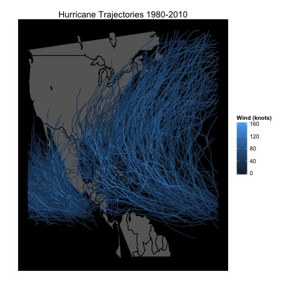
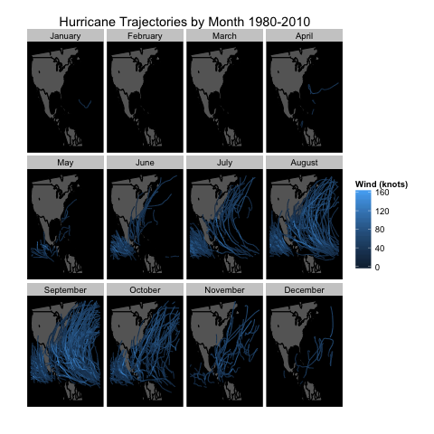
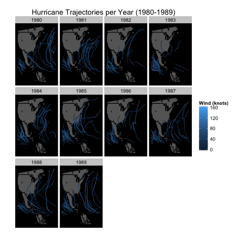
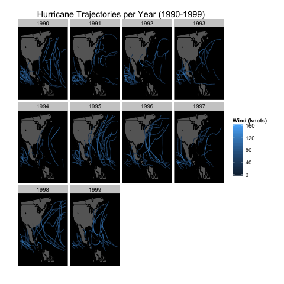
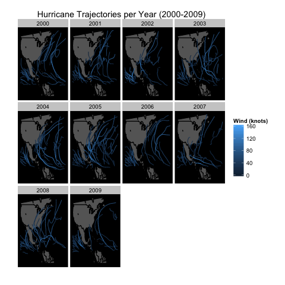

This project focused on IBTrACS hurricane data, which was found on the National Climatic Data Center website. While there were several different files that were worked with, the visuals of this project were produced from hurricane data in the North Atlantic and East Pacific Basins in the years of 1980 to 2010. 

This visual shows the trajectory of all hurricanes in the North Atlantic and East Pacific basins during the years of 1980 to 2010. This graphic gives us a sense of the scope of these hurricanes and where hurricanes commonly occurred during these years in general. 

This visual breaks down how often hurricanes occur during specific months and the hurricane trajectory during the years of 1980 to 2010. 

The following three visuals depict hurricane trajectories per year during specific decades, allowing us to get a better sense of when hurricanes hit these basins in each era. 

